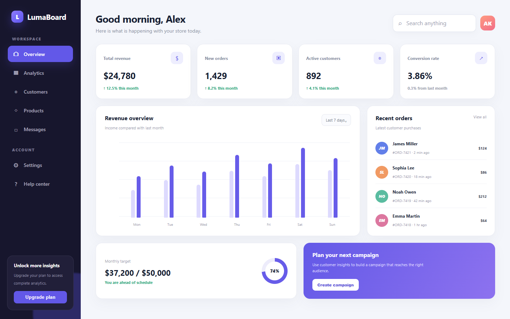
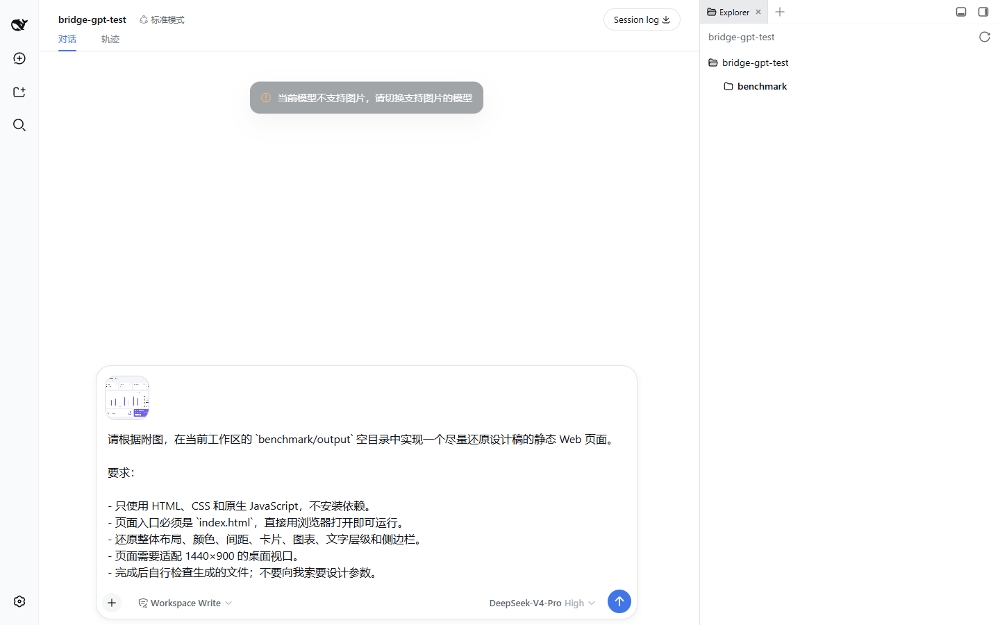
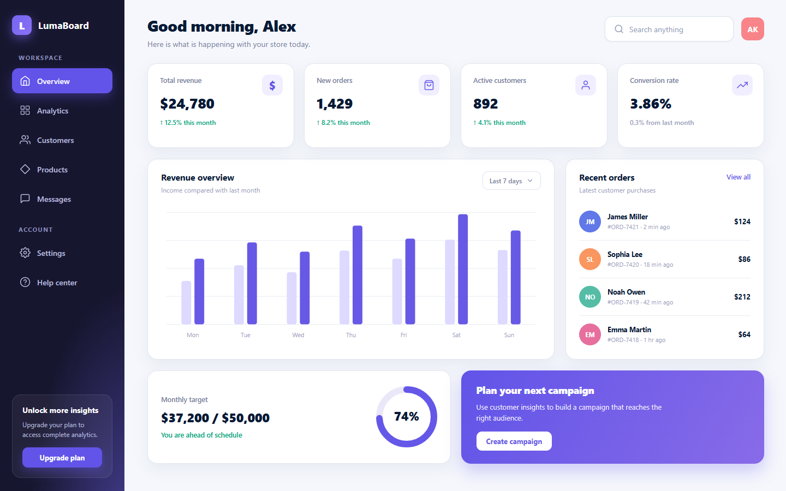

# 图片驱动 Web 开发对比测试

本测试比较 DeepSeek Harness 中直接选择 `DeepSeek-V4-Pro` 与选择 `Mix` 时，完成同一个图片驱动开发任务的结果。测试于 2026 年 8 月 15 日至 16 日在本地 DSH Web 和 Vision Mix 的 0.1.5 原型版本上执行。

## 测试目标

从一张 1440×900 的数据看板设计稿出发，在空目录实现可以直接打开的静态页面。页面只允许使用 HTML、CSS 和原生 JavaScript。

参考图由 [benchmark/reference.html](benchmark/reference.html) 在 1440×900 视口中渲染得到。它包含深色侧边栏、四张 KPI 卡片、双系列柱状图、最近订单列表、月度目标环和营销卡，规模足以检验布局、配色、文字层级和组件识别，又不依赖框架或外部素材。

完整输入见 [benchmark/PROMPT.md](benchmark/PROMPT.md)。两组使用相同图片和相同文本，没有向任何一组提供隐藏的布局参数。

## 测试条件

| 项目 | DeepSeek-V4-Pro | Mix |
|---|---|---|
| DSH 入口 | Web，标准模式 | Web，标准模式 |
| 权限 | Workspace Write | Workspace Write；成品截图时批准一次浏览器全权限运行 |
| 提示轮数 | 1 | 1 |
| 文本提示词 | 完全相同 | 完全相同 |
| 图片 | 同一张 `benchmark-reference.png` | 同一张 `benchmark-reference.png` |
| 基础模型 | `deepseek-official/deepseek-v4-pro`，High | `deepseek-official/deepseek-v4-pro` |
| 图片模型 | 无 | `codex-local/gpt-5.6-sol` |
| 意图模型 | 无需使用 | `deepseek-official/deepseek-v4-flash`，本轮无需使用 |
| 人工追加提示 | 无 | 无 |

输出目录在每组开始前为空。DeepSeek-V4-Pro 被能力门禁拒绝后没有写入文件；Mix 随后在同一空目录执行。Mix 完成后，由测试者独立打开生成页面进行验收，没有修改模型生成的源码。

## DeepSeek-V4-Pro 结果

直接选择 DeepSeek-V4-Pro 并发送图片时，DSH 在提交阶段提示：

> 当前模型不支持图片，请切换支持图片的模型

Agent 没有启动，未调用工具，输出目录保持为空。这是模型输入能力声明的正常门禁，不代表 DeepSeek-V4-Pro 的纯文本编码能力。

## Mix 结果

Mix 接受同一条图片消息，并将视觉分析结果交给相同的 DeepSeek-V4-Pro 基础模型。基础模型随后对 attachment 继续提出布局、颜色和排版问题，生成页面，再截图检查生成结果。

最终生成三个文件：

| 文件 | 大小 | 内容 |
|---|---:|---|
| `index.html` | 10,177 B | 页面结构和所有看板内容 |
| `styles.css` | 11,361 B | 布局、颜色、间距、卡片、侧边栏和响应式样式 |
| `app.js` | 5,161 B | 柱状图、74% 环形进度及简单交互 |

原始产物保存在 [benchmark/result/mix](benchmark/result/mix/)。以下截图由测试者直接打开该产物后生成，没有二次修改代码。

## 运行记录

DSH 会话显示的 Mix 运行数据：

| 指标 | 结果 |
|---|---:|
| 总耗时 | 8分37秒 |
| Turn / Agent step | 1 / 11 |
| LLM 时间 | 6分42秒 |
| 工具时间 | 3分31秒 |
| 输入 token | 约 400K |
| 输出 token | 约 37.5K |
| Vision Mix 图片调用 | 6 次 |

六次图片调用分别是：

1. 用户消息进入 Mix 后的初始设计稿分析。
2. 基础模型追问整体布局与组件关系。
3. 基础模型追问准确配色。
4. 基础模型追问排版、间距和卡片样式。
5. 基础模型检查首次渲染的完整成品截图。
6. 基础模型再次检查顶部区域和颜色一致性。

这组数据同时暴露了代价：主动多次查看图片能提高细节还原和自检能力，但会增加图片模型调用、上下文和总耗时。它不是免费增强。

## 独立验收

模型结束后，测试者使用浏览器在 1440×900 视口直接打开 `index.html`，得到以下结果：

- 页面标题、侧边栏、四张 KPI 卡、柱状图、订单列表、月度目标和营销卡全部存在。
- 页面 `scrollWidth` 和 `scrollHeight` 分别为 1440 和 900，与视口完全一致，没有意外滚动或裁切。
- 浏览器控制台错误为 0，页面运行时异常为 0。
- 主要文案、数据、配色和布局与参考图一致。
- 可见差异主要是图标线条、少量卡片间距和柱状图柱高，并非逐像素复制。

## 结论

这不是通用的模型编码能力排名。测试只回答一个具体问题：当开发任务依赖一张用户上传的设计稿时，直接选择只声明文本输入的 DeepSeek-V4-Pro 无法开始；选择 Mix 后，同一个 DeepSeek-V4-Pro 可以通过 Vision Mix 获取图片内容、按 attachment 继续追问像素，并完成可运行页面和视觉自检。

换句话说，Mix 保留了基础模型的 Agent 和编码能力，同时补上了图片输入、跨步骤视觉上下文和重复看图能力。
