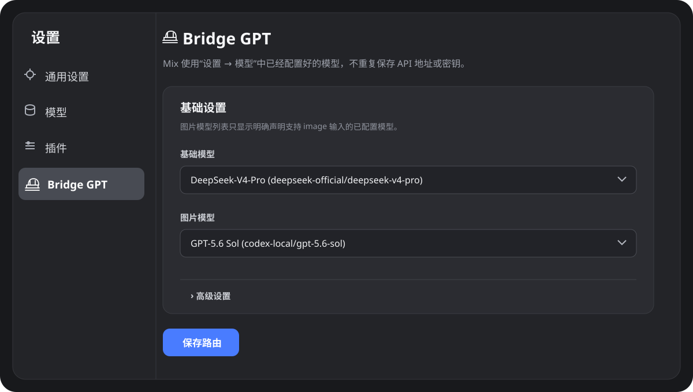
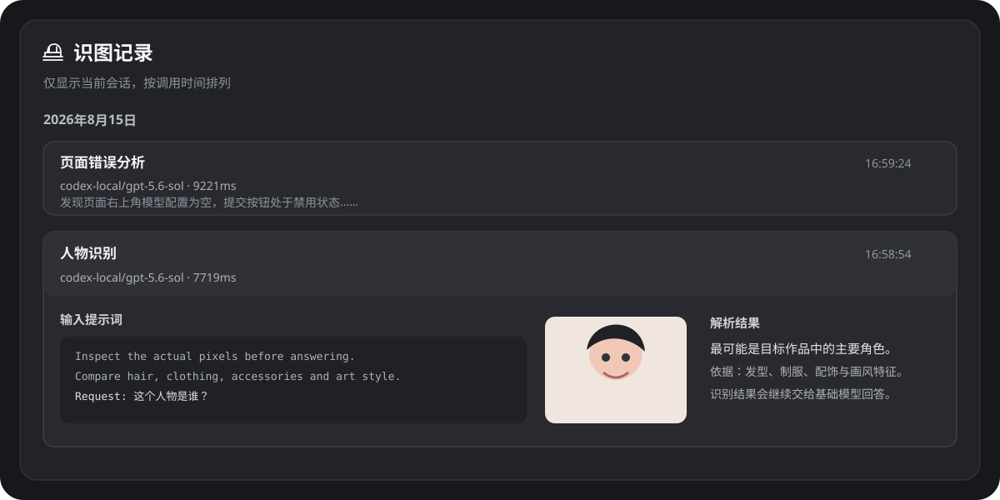

# DSH Codex Bridge


`dsh-codex-bridge` 是一个符合 DeepSeek Harness / Cordis 插件格式的多模型桥接插件。它注册固定虚拟模型 `Mix`，将普通文本交给基础模型，将用户图片、Agent 截图和工具返回图片交给已配置的视觉模型，再把结构化识图结果交回基础模型继续推理。

插件不保存 API Key、Base URL 或协议配置。模型及密钥继续由 Web 的“设置 → 模型”统一管理。

## 界面预览



识图记录按会话隔离并按时间排列。每条记录默认折叠，只显示标题、模型、耗时和结果摘要；点击后显示完整提示词、图片及解析结果。



## 路由行为

| 输入 | 路由 |
|---|---|
| 纯文本消息 | `Mix` 直接调用基础模型，不调用视觉模型或意图模型 |
| 用户上传图片 | 视觉模型先分析图片，基础模型读取文字分析上下文后回复 |
| Agent 截图或工具返回图片 | 工具完成后分析真实的 `image` content block，再把结果追加到下一步上下文 |
| 工具没有返回图片 | 原样继续，不触发视觉模型或意图模型 |

视觉预处理提示词会要求模型检查实际像素：人物和虚构角色会比较发型、服装、配饰、画风与可能出处；界面截图会提取文字、布局、控件状态和错误区域。发送给视觉模型的完整提示词也会记录在侧边栏中。

完整设计见 [DESIGN.md](DESIGN.md)。

## 侧边栏是可选依赖

`dsh-better-sidebar` 不是插件启动的必要条件：

- 已安装时：注册桥形图标的“识图记录”标签。
- 未安装时：不显示侧边栏标签，但 `Mix` 路由、Bridge GPT 设置、图片分析、HTTP 接口及会话记录持久化保持可用。
- 侧边栏稍后加载时：插件通过 Cordis 可选注入自动注册标签，不依赖固定加载顺序。

## 安装

要求 Node.js `^22.19.0` 或 `>=24.0.0`，并使用 pnpm。

推荐安装 GitHub Release 中已经构建好的 tarball。它不需要批准构建脚本：

```powershell
cd E:\git\deepseek-harness
pnpm dsh plugin --profile web add https://github.com/haiziyao/dsh-codex-bridge/releases/download/v0.1.0/dsh-codex-bridge-0.1.0.tgz
```

安装命令会把插件依赖和 bundle 写入 Web profile。之后直接启动：

```powershell
pnpm dsh web
```

从本地 checkout 安装时，在 Harness 根目录执行：

```powershell
pnpm dsh plugin --profile web add ../dsh-codex-bridge
```

也可以直接从 GitHub 源码安装：

```powershell
pnpm dsh plugin --profile web add github:haiziyao/dsh-codex-bridge
```

Git 源安装会通过 `prepare` 脚本生成服务端和 Web 客户端 bundle。按照 DSH 和 pnpm 10 及以上的安全策略，第一次命令会停止并打印一条完整的 `allowBuilds` 键。把该键原样加入 `%USERPROFILE%\.dsh\profiles\web\pnpm-workspace.yaml` 后重新执行同一命令：

```yaml
allowBuilds:
  'dsh-codex-bridge@https://codeload.github.com/...': true
```

必须使用 pnpm 错误中给出的完整 URL 和 commit 键，不能照抄上面的省略示例。通过 DSH Market 安装时，市场界面会负责这一步显式授权。

如果 profile 已启用 `dsh-better-sidebar`，Bridge GPT 会自动添加“识图记录”标签；未启用时无需额外操作。

## 配置模型

先在 Web 的“设置 → 模型”中配置基础模型和视觉模型，包括 provider、协议、Base URL 与凭据。视觉模型必须声明支持 `image` 输入。

首次加载时的默认路由是：

```yaml
baseModel:
  provider: deepseek-official
  model: deepseek-v4-pro
imageModel:
  provider: codex-local
  model: gpt-5.6-sol
autoAnalyzeToolImages: true
```

插件 bundle 不会把这两项模型写入用户 profile。如果你的模型 id 不同，在“设置 → Bridge GPT”从全局已配置模型中选择基础模型、图片模型和可选意图识别模型，不需要再次填写密钥。

## 本地开发启动

无需安装到 profile 时，可以通过仓库内的开发 patch 启动：

```powershell
cd E:\git\deepseek-harness
pnpm dsh web --patch ../dsh-codex-bridge/dsh-patch.yml
```

打开 <http://127.0.0.1:3080>，在模型选择器中选择固定模型 `Mix`。

如果出现 `EADDRINUSE 127.0.0.1:3080`，说明已有一份 Web 服务正在运行。关闭旧进程后重新执行同一条命令，不要同时启动两份服务。

## 数据与安全

- 插件不包含硬编码 API Key。
- 模型请求通过 Harness 的模型注册表和凭据系统发送。
- 识图历史保存在 `$DSH_HOME/bridge-gpt/v1/calls/`。
- 图片预览同时校验 `sessionId` 和该会话的 `callId`。
- 记录只在当前会话的侧边栏中查询和显示。

## 开发验证

```powershell
pnpm run typecheck
pnpm run test
pnpm run build
```

`pnpm run check` 会依次执行全部三项。

## License

[MIT](LICENSE)
